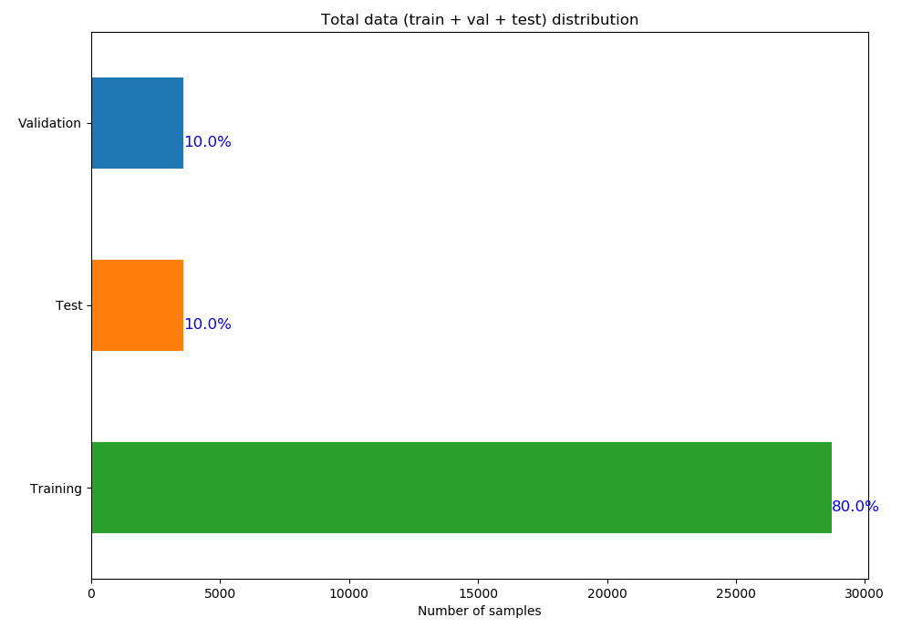
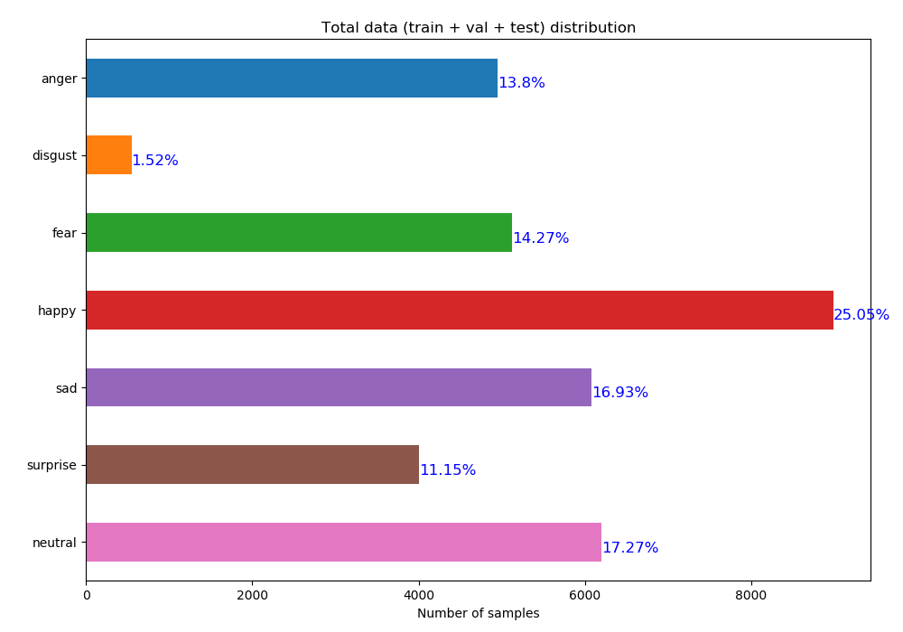
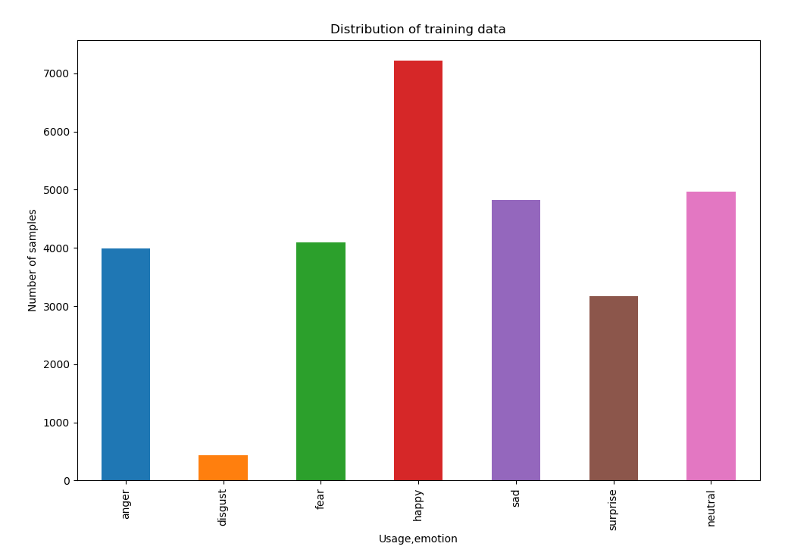
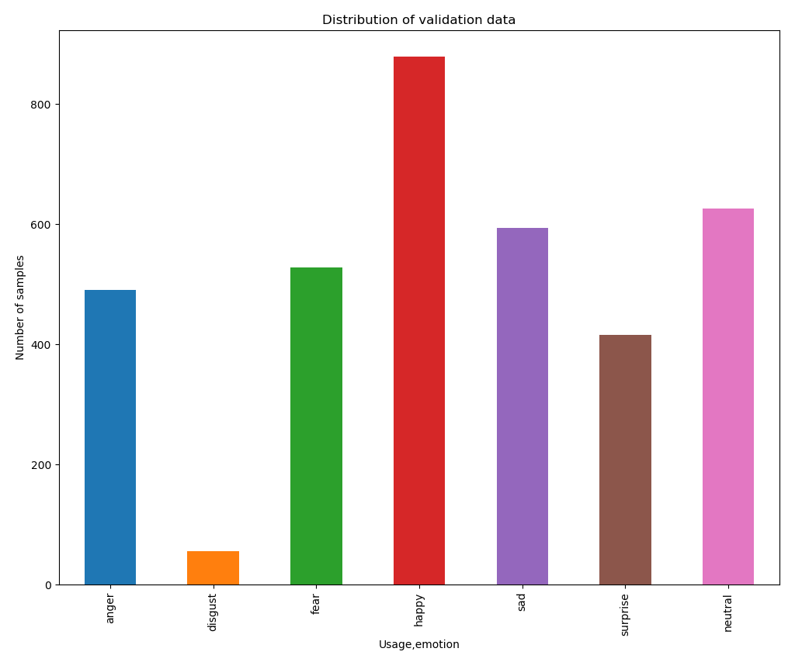
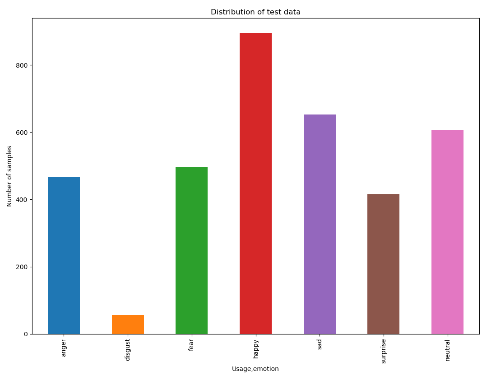
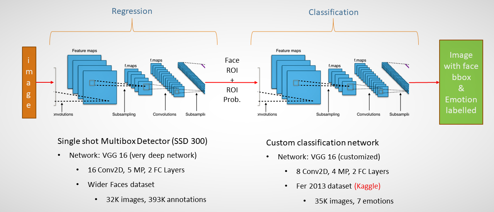
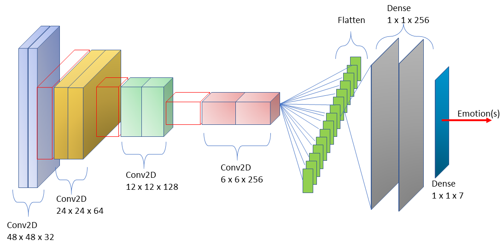
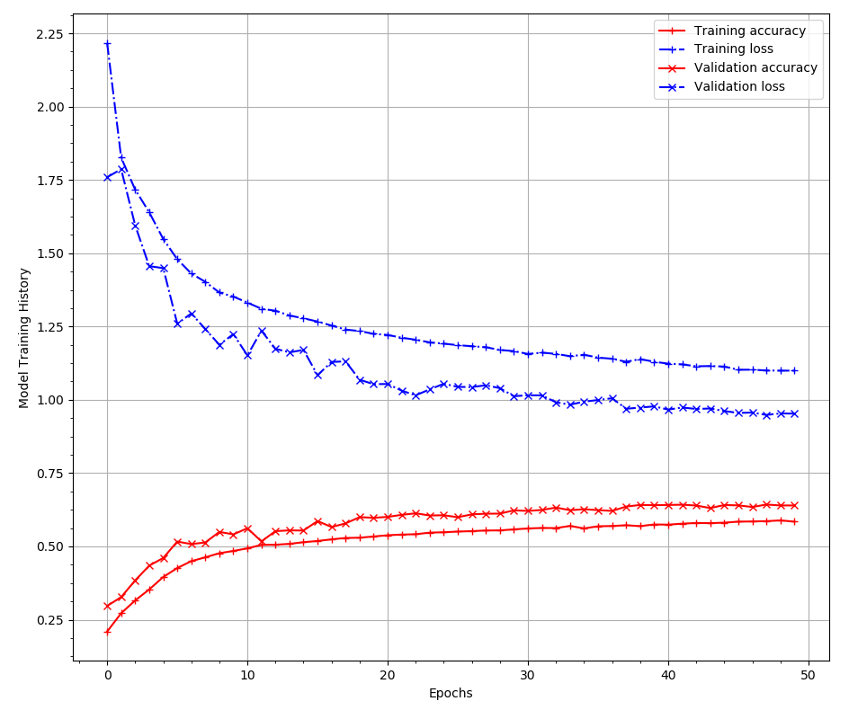
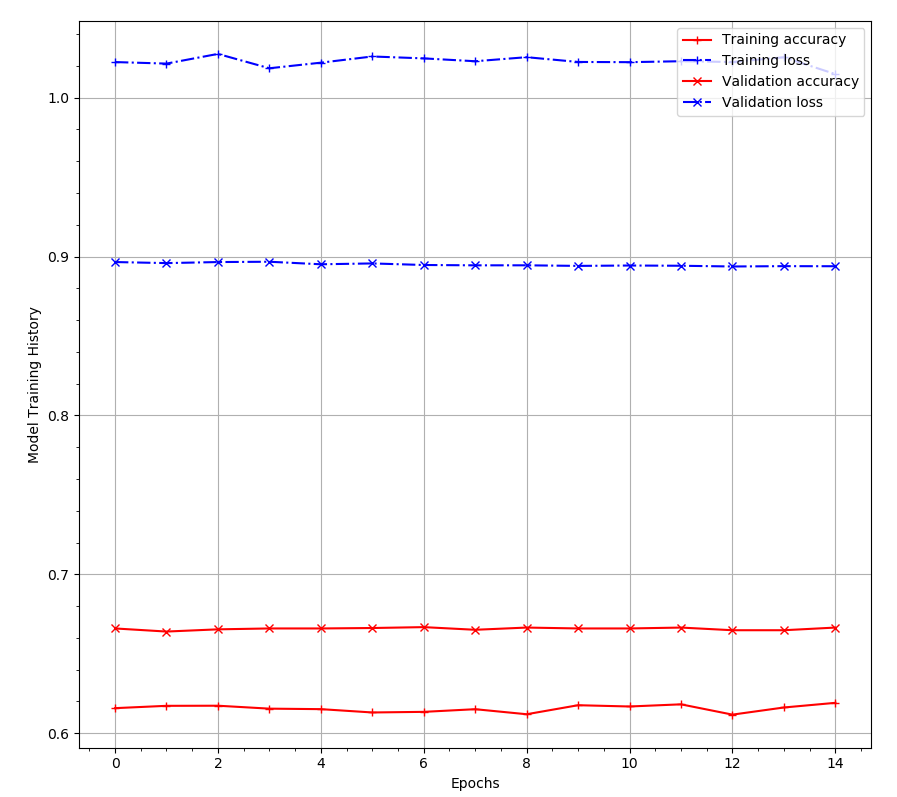
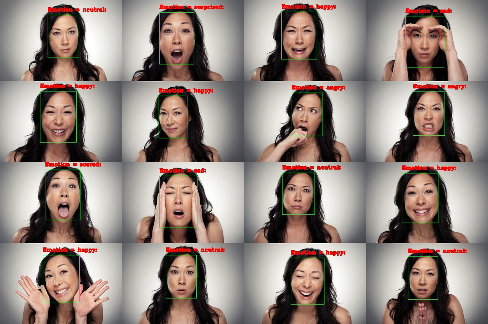

# EmotionClassification_FER2013

*Figure 1: Emotion classification headline*

Emotion classification has always been a very challenging task in Computer Vision. 
Using the FER 2013 released by Kaggle, this project couples an deep learning based face detector 
and an emotion classification DNN to classify the six/seven basic human emotions. 

## Basic Human Emotions (background):
Affective Computing has an annotation problem. Facial expression recognition is a difficult challenge 
because human emotions are very subjective and fluid. We never exhibit 100% of any particular emotion
and our emotions (exhibited through facial expression) are always a mixture of a number of emotions.

Having said so, human facial expressions and emotions can be broadly (and somwwhat incorrectly) classified
into 7 basic emotions which are as follows:
### emotions = [anger, disgust, fear, happy, sad, surprise, neutral]

However, based on recent research 
In 2013, Kaggle released a challenge [1] to classify these seven emotions using deep neural networks. This project is designed around that challenge to build, train and test a deep neural net to classify the seven emotions. 

NOTE: Although, by default we should classify all 7 emotions, a recent project in 2016 [2] noted that the classification accuracy is somewhat improved when the classes "anger and disgust" is merged into a single class "anger". Therefore, this project allows you to build the dataset for both 6 or 7 emotions depending upon requirements/wish. A marginal improvement in the final results can be noted when the emotions are merged.

## Dataset:
The FER 2013 dataset consists of 35887 images across 3 categories:

Summary:
#### Training set: 28709, Validation set: 3589, Test set: 3589 (across all 7 emotions)

 

*Figure 2: Left: total data distribution, right: emotion distribution (train + val + test) sets*

The above figures show clearly that the data is distributed in an 80 + 10 + 10 split where the validation and training data each consists of 10% of the total number of samples. Upon further investigation it was found that the number of samples belonging to the "disgust" class is remarkably lower (~1.5%) than the other classes, with "happy" (~25%) consisting the max number of samples. This is one of the primary reasons of merging the "anger" and "disgust" class to create a more balanced dataset as done by [2]. Thus, this project allows for emotion classification of either 6 or 7 emotions based on the choice of the user.

Finally, to explore the data distribution slightly further, the overall data is divided according to their usage (training/ validation/ test) and their distribution is given in the figures below:

  

   

*Figure 3: Emotion distribution across Training, Validation and Test data sets*

Again, as seen earlier in Figure 2, the data distributions shown in Figure 3 demonstrates that all three sets are more or less similar with the "disgust" class remarkably trailing (in number of samples) compared to other emotions.

OK, so finally we move to the next section which describes the overall pipeline of the project.

## Overall pipeline

*Figure 4: Emotion classification headline (localization & detection using SSD and classification using VGG like network*

The challenge presented in this project can be considered as a Regression and Classification challenge where the face detection is a regression problem and the detected ROI is then classified by a classification model trained FER 2013 dataset (detailed above).

Solution: Stack two deep learning based models (face detection + classification). The face detector is based on the Single Shot Multibox Detector (SSD) [3] which extracts the face from the input image. The face/faces (ROI) is/are then fed to the classification model which predicts and classifies the emotion (exhibited by the face) as shown in Figure 4. The output of this procedure (detection and classification is later shown in Section "Output". 

NOTE: Although, the output from the emotion classifier consists of probabiility distribution histogram, in this case, only the expression with most probability is extracted and shown as the output. 

## Network Architecture:

*Figure 5: Network architecture of Single Shot Multibox Dectector [3] for face detection*

*Figure 6: Custom VGG [4] like (sequential) classification network*

#### NOTE: The project consists another deeper architecture with more convolution and maxpool layers. However, it was found that usage of a deeper architecture did not necessarily mean better classification.

## Prerequisites:
I have tried to keep as little requirements as possible to run this project. The minimum requirements are given as below:

  1) Min CUDA 8.0 and CUDNN 6.0 (you may change to other versions) - but ensure that you have compatible CUDA and CUDNN
  2) Numpy 
  3) Matplotlib
  4) Tensorflow-GPU 1.4.0 (min) - matching with CUDA 8.0 and CUDNN 6.0 
  5) Keras 2.1.6 (min)
  6) h5py 
  7) OpenCV 3.4 preferably (because it supports DNN module) - can use the face detection pre-trained caffe model
  8) Python pydot and Graphviz software [5] (in case you want to save the network to a file to visualize and modify)
  
## Building dataset (for training from scratch)
To build the dataset, you need to create a folder structure similar to the folder "FacialExpressionRecognition" given in this project. That is your "BASE_PATH". 

The base path consists of three subfolders:

1) fer2013 (where you should unpack the input dataset from kaggle

2) hdf5 (where the input dataset should be divided into training, validation and test sets (all .hdf5 files) and used later

3) output (where the training output models will be stored)

#### STEP 1: Unpack the FER 2013 (from Kaggle [6]) and dump it to "fer2013" folder inside your base_path
#### STEP 2: Use BuildDataset.py to build the .hdf5 files in the hdf5 folder (discussed later in this section)

Usage: BuildDataSet.py (to build the HDF5 files from the input CSV):

	python BuildDataSet.py -b <base_path> -n <number_of_emotions> 

Typical parameters: 

1) base_path = the folder which contains the fer2013, hdf5 and output subfolders (such as the included FacialExpressionRecognition)

2) number_of_emotions = either 6 or emotions (ensure this matches with the dataset build)

##### NOTE: Please ensure that the number of emotions remains the same for training, testing and prediction (discussed in later sections)

## Training the networks:
OpenCV 3.4 comes with a pre-trained SSD for face detection DNN model trained with caffe. Therefore, for convenience, the face.caffemodel and deploy.protxt.txt is included in the "output" folder of the project. Also, pre-trained models from the classification network with either 7 or 6 emotions are included in the output folder and can be used for emotion prediction. 

### Training the classification network:
Following the dataset build (mentioned in the previous section), the randomly initialized emotion classification network can be trained end-to-end using the TrainNetwork.py file.

Usage:

	python TrainNetwork.py -b <base_path> -n <number_of_emotions> -im <input_model_name (optional)> -om <output_model_name (optional)> -lr <learning_rate (optional)> -epochs <number_of_epochs>

Typical paramters:

1) base_path = the folder which contains the fer2013, hdf5 and output subfolders (such as the included FacialExpressionRecognition)

2) number_of_emotions = either 6 or emotions (ensure this matches with the dataset build)

3) input_model_name = None (if you are training from scratch), <you pretrained name> if you are improving after already some training (this allows fine tuing after a few epochs) by changing the learning rate
	
4) output_model_name = optional argument but recommended. Default name: emotion_classification_final.hdf5

5) learning_rate = default is 1e-3 (Adam). 
	
		if lr is None:
			old_lr = get_lr_from_input_model(input_model_name)
			new_lr = old_lr/10 
		end
		
6) number_of_epochs = 60 to 80 (first round with lr = 1e-3), 20 (second round with lr = 1e-4) and 10 (third round with lr = 1e-5). 

#### NOTE: the network has an Early Stopping Monitor. So it will stop training if there is no improvement in validation loss after a few epochs. 

So with these parameters, I trained the network and achieved pretty good results compared to the relevant submissions in Kaggle as shown below in Figure 7.

  

 

*Figure 7: Train_accuracy, Train_loss, val_accuracy and val_loss for main training + finetune1 + finetune2*

## Testing the classification network:
The emotion classification models trained on 6/7 emotions can be tested using the "TestNetwork.py" file with the following arguments:
	
	python TestNetwork.py -b <base_path> -n <number_of_emotions> -im <pretrained_model_name>

Typical parameters: 

1) base_path = the folder which contains the fer2013, hdf5 and output subfolders (such as the included FacialExpressionRecognition)

2) num_of_emotions = 6/7 (depending on how you build your dataset)

3) input_model_name = name of the pretrained model (saved/dumped into the output folder of the base_path). 

###### NOTE: For the sake of convenience, I have included 2 pretrained models "emotion_classification_6classes.hdf5" and "emotion_classification_7classes.hdf5" for 6 and 7 emotions, respectively. Both achieve almost similar results to the best posted in Kaggle. 

## Emotion Detection: 
Although this the final execution script, I am writing this now because this is the most important class of the entire project and the project can be executed with the included pre-trained classifiers and face detection models using this script.

Usage:

	python -b <base_path> -n <number_of_emotions> -m <input_model_name> -i <absolute_input_image_path> -o <absolute_output_image_path>

Typical Parameters: 
1) base_path = the folder which contains the fer2013, hdf5 and output subfolders (such as the included FacialExpressionRecognition)

2) num_of_emotions = 6/7 (depending on how you build your dataset)

3) input_model_name = name of the pretrained model (saved/dumped into the output folder of the base_path). 

4) input_image_path = in this case the test image in the output folder of the base_path

5) output_image_path = in this case the path where you want to dump the output of the face detector and classifier.

## Results and Discussion:

*Figure 8: Final Results: Output from the SSD face detector and emotion classifier (only the emotion with highest probability is displayed)*

The final results shown in Figure 8 demonstrates that the face detection model is quite accurate in detecting faces from background. A few background studies have demonstrated that using a deep learning detector provides more accurate than the only front facing HAAR classifier. The ROI passed from the detector is fed to the classifer network which decides the highest probability of emtions. Subsequently, the bounding box (for face) is annotated with the emotion (with max probability). 

#### NOTE: The classification accuracy can probably be increased by using inception modules (such as GoogLeNet [7]) to build the classifier network instead of a sequential model.

## References
[1] Ian J. Goodfellow et al. “Challenges in Representation Learning: A Report on Three Machine Learning Contests”. In: Neural Information Processing: 20th International Conference, ICONIP 2013, Daegu, Korea, November 3-7, 2013. Proceedings, Part III. Edited by Minho Lee et al. Berlin, Heidelberg: Springer Berlin Heidelberg, 2013, pages 117–124. ISBN: 978-3-642-42051-1. DOI: 10.1007/978-3-642-42051-1_16. URL: https://doi.org/10.1007/978-3-642-42051-1_16

[2] Jostine Ho. Facial Emotion Recognition. https://github.com/JostineHo/mememoji/

[3] Liu, Wei, Dragomir Anguelov, Dumitru Erhan, Christian Szegedy, Scott Reed, Cheng-Yang Fu, and Alexander C. Berg. "Ssd: Single shot multibox detector." In European conference on computer vision, pp. 21-37. Springer, Cham, 2016.

[4] Simonyan, Karen, and Andrew Zisserman. "Very deep convolutional networks for large-scale image recognition." arXiv preprint arXiv:1409.1556 (2014).

[5] Graphviz Software: https://www.graphviz.org/

[6] FER 2013 dataset: https://www.kaggle.com/c/challenges-in-representation-learning-facial-expression-recognition-challenge/data

[7] Szegedy, Christian, Wei Liu, Yangqing Jia, Pierre Sermanet, Scott Reed, Dragomir Anguelov, Dumitru Erhan, Vincent Vanhoucke, and Andrew Rabinovich. "Going deeper with convolutions." In Proceedings of the IEEE conference on computer vision and pattern recognition, pp. 1-9. 2015.
